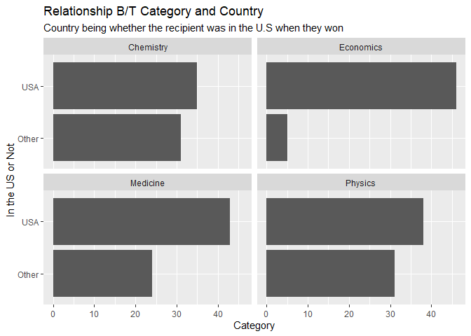
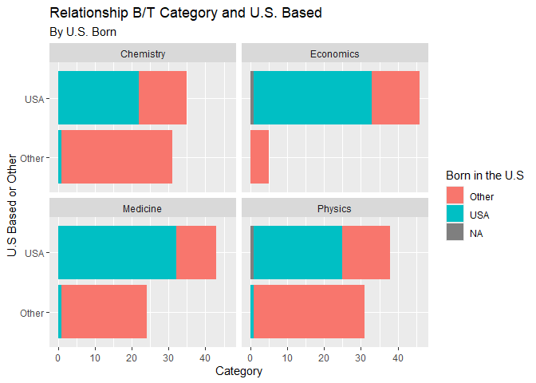

Lab 03 - Nobel laureates
================
Kryschelle Fakir
2/6/2026

### Load packages and data

``` r
library(tidyverse) 
```

``` r
nobel <- read_csv("data/nobel.csv")
```

## Exercises

Here is a link to the [lab
instructions](https://datascience4psych.github.io/DataScience4Psych/lab03.html).

### Exercise 1

``` r
glimpse(nobel)
```

    ## Rows: 1,026
    ## Columns: 26
    ## $ id                    <dbl> 1, 2, 3, 4, 5, 6, 6, 8, 9, 10, 11, 12, 13, 14, 1…
    ## $ firstname             <chr> "Wilhelm Conrad", "Hendrik A.", "Pieter", "Henri…
    ## $ surname               <chr> "Röntgen", "Lorentz", "Zeeman", "Becquerel", "Cu…
    ## $ year                  <dbl> 1901, 1902, 1902, 1903, 1903, 1903, 1911, 1904, …
    ## $ category              <chr> "Physics", "Physics", "Physics", "Physics", "Phy…
    ## $ affiliation           <chr> "Munich University", "Leiden University", "Amste…
    ## $ city                  <chr> "Munich", "Leiden", "Amsterdam", "Paris", "Paris…
    ## $ country               <chr> "Germany", "Netherlands", "Netherlands", "France…
    ## $ born_date             <date> 1845-03-27, 1853-07-18, 1865-05-25, 1852-12-15,…
    ## $ died_date             <date> 1923-02-10, 1928-02-04, 1943-10-09, 1908-08-25,…
    ## $ gender                <chr> "male", "male", "male", "male", "male", "female"…
    ## $ born_city             <chr> "Remscheid", "Arnhem", "Zonnemaire", "Paris", "P…
    ## $ born_country          <chr> "Germany", "Netherlands", "Netherlands", "France…
    ## $ born_country_code     <chr> "DE", "NL", "NL", "FR", "FR", "PL", "PL", "GB", …
    ## $ died_city             <chr> "Munich", NA, "Amsterdam", NA, "Paris", "Sallanc…
    ## $ died_country          <chr> "Germany", "Netherlands", "Netherlands", "France…
    ## $ died_country_code     <chr> "DE", "NL", "NL", "FR", "FR", "FR", "FR", "GB", …
    ## $ overall_motivation    <chr> NA, NA, NA, NA, NA, NA, NA, NA, NA, NA, NA, NA, …
    ## $ share                 <dbl> 1, 2, 2, 2, 4, 4, 1, 1, 1, 1, 1, 1, 2, 2, 1, 1, …
    ## $ motivation            <chr> "'in recognition of the extraordinary services h…
    ## $ born_country_original <chr> "Prussia (now Germany)", "the Netherlands", "the…
    ## $ born_city_original    <chr> "Lennep (now Remscheid)", "Arnhem", "Zonnemaire"…
    ## $ died_country_original <chr> "Germany", "the Netherlands", "the Netherlands",…
    ## $ died_city_original    <chr> "Munich", NA, "Amsterdam", NA, "Paris", "Sallanc…
    ## $ city_original         <chr> "Munich", "Leiden", "Amsterdam", "Paris", "Paris…
    ## $ country_original      <chr> "Germany", "the Netherlands", "the Netherlands",…

``` r
dim(nobel)
```

    ## [1] 1026   26

``` r
nobel_living <- nobel %>%
  filter( 
    is.na(died_date),
    !is.na(country), 
    gender != "org"
  ) 
```

There are 1026 observations and 26 variables in the nobel dataset. Each
row represents a nobel prize winner.

### Exercise 2

``` r
nobel_living <- nobel_living %>%
  mutate(
    country_us = if_else(country == "USA", "USA", "Other")
  )

nobel_living_science <- nobel_living %>%
  filter(category %in% c("Physics", "Medicine", "Chemistry", "Economics"))

dim(nobel_living_science)
```

    ## [1] 253  27

### Exercise 3

``` r
ggplot(
  data = nobel_living_science,
       mapping = aes(
         x = country_us
       )
) + 
  geom_bar() +
  facet_wrap(~category) + 
  coord_flip() + 
  labs(
    title = "Relationship B/T Category and Country",
    subtitle = "Country being whether the recipient was in the U.S when they won",
    x = "In the US or Not",
    y = "Category"
  )
```

<!-- -->

Based on the visualization, it does seem that most winners were based in
the US when they won their nobel prize. However, the Chemistry and
Physics categories are very close, especially compared to the Economics
category. This may suggest that lots of folks are studying the U.S’
economics (I wonder why… \>:T)

### Exercise 4

``` r
nobel_living <- nobel_living %>%
  mutate(
    born_country_us = if_else(born_country == "USA", "USA", "Other")
  ) 

nobel_living %>%
  count(born_country_us)
```

    ## # A tibble: 3 × 2
    ##   born_country_us     n
    ##   <chr>           <int>
    ## 1 Other             138
    ## 2 USA               113
    ## 3 <NA>                2

113 of the U.S based Nobel laureates were born in the U.S.

### Exercise 5

``` r
nobel_living_science <- nobel_living_science %>%
  mutate(
    born_country_us = if_else(born_country == "USA", "USA", "Other")
  ) 

ggplot(
  data = nobel_living_science,
       mapping = aes(
         x = country_us,
         fill = born_country_us
       )
) + 
  geom_bar() +
  facet_wrap(~category) + 
  coord_flip() + 
  labs(
    title = "Relationship B/T Category and U.S. Based",
    subtitle = "By U.S. Born",
    fill = "Born in the U.S",
    x = "U.S Based or Other",
    y = "Category"
  ) 
```

<!-- -->

Based on the visualization above, Buzzfeed’s claim is incorrect.
Majority of the U.S based Nobel Laureates are born in the U.S. Of those
based in the U.S, regardless of category, majority are born in the U.S.

### Exercise 6

``` r
nobel_born_outside_us <- nobel_living_science %>%
  filter(
    country_us == "USA",
    born_country_us == "Other")

nobel_born_outside_us %>%
  count(born_country) %>%
  arrange(desc(n))
```

    ## # A tibble: 25 × 2
    ##    born_country       n
    ##    <chr>          <int>
    ##  1 United Kingdom    10
    ##  2 Canada             5
    ##  3 Germany            5
    ##  4 Japan              4
    ##  5 France             3
    ##  6 Australia          2
    ##  7 Netherlands        2
    ##  8 Turkey             2
    ##  9 Austria            1
    ## 10 China              1
    ## # ℹ 15 more rows

The most common country is the United Kingdom.
